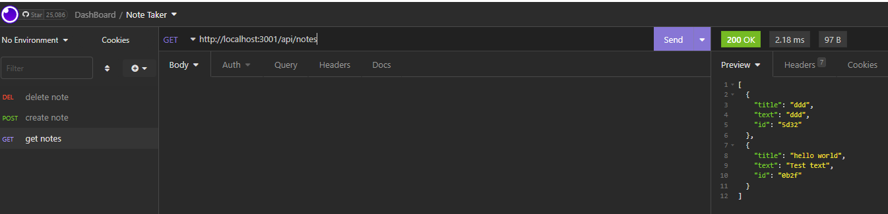
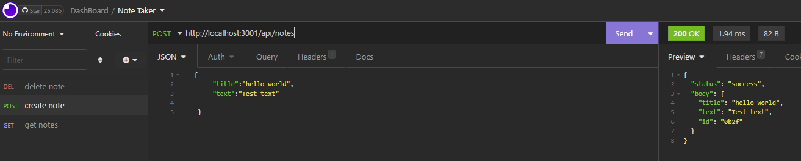
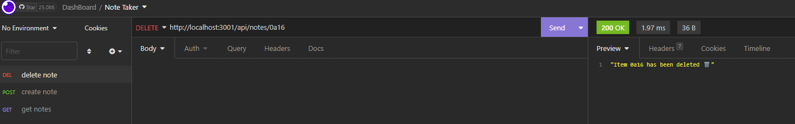

# Note Taker
### Siddharth Desai

## Description

The purpose of this project was to build a application to help track my notes and store my notes in file (JSON). This project utilizes express, node and is deployed on heroku. The user has an option to post a new note, delete an existing note and of course view any old note.

[](https://opensource.org/licenses/MIT)


## User Story

```
AS A small business owner
I WANT to be able to write and save notes
SO THAT I can organize my thoughts and keep track of tasks I need to complete
```


## Acceptance Criteria

```
GIVEN a note-taking application
WHEN I open the Note Taker
THEN I am presented with a landing page with a link to a notes page
WHEN I click on the link to the notes page
THEN I am presented with a page with existing notes listed in the left-hand column, plus empty fields to enter a new note title and the note’s text in the right-hand column
WHEN I enter a new note title and the note’s text
THEN a Save icon appears in the navigation at the top of the page
WHEN I click on the Save icon
THEN the new note I have entered is saved and appears in the left-hand column with the other existing notes
WHEN I click on an existing note in the list in the left-hand column
THEN that note appears in the right-hand column
WHEN I click on the Write icon in the navigation at the top of the page
THEN I am presented with empty fields to enter a new note title and the note’s text in the right-hand column
```


## Table of Contents
1. [ Description. ](#description)
2. [ Installation. ](#installation)
3. [ Usage. ](#usage)
4. [ License. ](#license)
6. [ Tests. ](#tests)
7. [ Questions. ](#questions)
8. [ Screenshots. ](#screenshots)
9. [ Resources. ](#resources)
10. [ Links. ](#links)


## Installation
* Clone the repository using:
```
git clone git@github.com:shd327/Note-Taker.git
```
* Ensure you are in the current working directory
* Ensure all dependencies are installed as shown below installation instructions are below:
```
  "dependencies": {
    "express": "^4.16.4"
  }

```
```
npm install express
```

Run the the app by typing the following in the terminal:
```
node server.js
```

## Usage
* Naviagte to the project directory in a integrated terminal
* Run the server.js (node index.js)
* Now in your browser navigate to http://localhost:3001 and the application will display

## License
MIT License

Copyright (c) 2022 Siddharth Desai

Permission is hereby granted, free of charge, to any person obtaining a copy
of this software and associated documentation files (the "Software"), to deal
in the Software without restriction, including without limitation the rights
to use, copy, modify, merge, publish, distribute, sublicense, and/or sell
copies of the Software, and to permit persons to whom the Software is
furnished to do so, subject to the following conditions:

The above copyright notice and this permission notice shall be included in all
copies or substantial portions of the Software.

THE SOFTWARE IS PROVIDED "AS IS", WITHOUT WARRANTY OF ANY KIND, EXPRESS OR
IMPLIED, INCLUDING BUT NOT LIMITED TO THE WARRANTIES OF MERCHANTABILITY,
FITNESS FOR A PARTICULAR PURPOSE AND NONINFRINGEMENT. IN NO EVENT SHALL THE
AUTHORS OR COPYRIGHT HOLDERS BE LIABLE FOR ANY CLAIM, DAMAGES OR OTHER
LIABILITY, WHETHER IN AN ACTION OF CONTRACT, TORT OR OTHERWISE, ARISING FROM,
OUT OF OR IN CONNECTION WITH THE SOFTWARE OR THE USE OR OTHER DEALINGS IN THE
SOFTWARE.

## Tests
N/A

## Questions?
Want to see more of my work? [Github Link](https://github.com/shd327)
<br/>
Want to learn more please contact me at shdesai327@gmail.com

## Screenshots






## Resources
https://expressjs.com/en/guide/routing.html


## Links

* [Github Link](https://github.com/shd327/Note-Taker)
